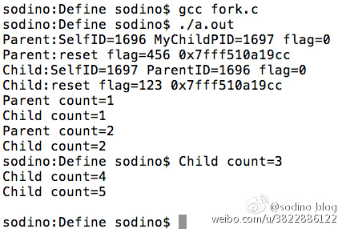

## 进程结构
　　Linux下一个进程在内存里有三部分的数据，就是”代码段”、”堆栈段”和”数据段”。接触过汇编语言的人了解，一般的CPU都有上述三种段寄存器，以方便操作系统的运行。这三个部分也是构成一个完整的执行序列的必要的部分。

　　“代码段”，顾名思义，就是存放了程序代码的数据，如果机器中有数个进程运行相同的一个程序，那么它们就可以使用相同的代码段。”堆栈段”存放的就是子程序的返回地址、子程序的参数以及程序的局部变量。而数据段则存放程序的全局变量，常数以及动态数据分配的数据空间（比如用malloc之类的函数取得的空间）。这其中有许多细节问题，这里限于篇幅就不多介绍了。系统如果同时运行数个相同的程序，它们之间就不能使用同一个堆栈段和数据段。

　　有两个基本的操作用于创建和修改进程：函数fork()用来创建一个新的进程，该进程几乎是当前进程的一个完全拷贝，利用了父进程的代码段、堆栈段、数据段，当父子进程中对共有的数据段进行重新设值或调用不同方法时，才会导致数据段及堆栈段的不同；函数族exec()用来启动另外的进程以取代当前运行的进程，除了PID仍是原来的值外，代码段、堆栈段、数据段已经完全被改写了。 　　

### fork函数

```C
    #include <unistd.h>
    pid_t fork(void);```
　　当执行fork()函数后，会生成一个子进程，子进程的执行从fork()的返回值开始且代码继续往下执行。

　　所以fork()执行一次后会有两次返回值：第一次为原来的进程，即父进程会有一次返回值，表示新生成的子进程的进程ID；第二次为子进程的起始执行，返回值为0。

　　如果返回值为-1，则表示创建子进程失败，可能通过errno定位失败原因。

示例代码
```C
//以下代码演示了fork()创建一个子进程，及如何根据返回值区分主进程与子进程等。

#include <stdio.h>
#include <stdlib.h>
#include <unistd.h>
int main (int argc, char ** argv) {
    int flag = 0;
    pid_t pId = fork();
    if (pId == -1) {
        perror("fork error");
        exit(EXIT_FAILURE);
    } else if (pId == 0) {
        int myPid = getpid();
        int parentPid = getppid();
        
        printf("Child:SelfID=%d ParentID=%d \n", myPid, parentPid);
        flag = 123;
        printf("Child:flag=%d %p \n", flag, &flag);
        int count = 0;
        do{
            count ++;
            sleep(1);
            printf("Child count=%d \n", count);
            if (count >= 5) {
                break;
            }
        }while (1);
        return EXIT_SUCCESS;
    } else {
        printf("Parent:SelfID=%d MyChildPID=%d \n", getpid(), pId);
        flag = 456;
        printf("Parent:flag=%d %p \n", flag, &flag); // 连地址都一样,说明是真的完全拷贝,但值已经是不同的了..
        int count = 0;
        do{
            count ++;
            sleep(1);
            printf("Parent count=%d \n", count);
            if (count >= 2) {
                break;
            }
        }while (1);
    }
    
    return EXIT_SUCCESS;
}```
　　以上代码中，使用fork()创建了一个子进程。返回值pId有两个作用：一是判断fork()是否正常执行；二是判断fork()正常执行后如何区分父子进程。

　　在父子进程中，都各自打印出自己的进程ID及父/子进程ID。

　　通过flag的值可以验证创建的子进程是完全复制父进程的堆栈段(因为flag是在main()方法内声明的)的，两个进程都输出了flag=0的信息。接下来进程可以各自对flag再次更新值，做到了互不干扰。但从打印的int指针地址来看，指针地址值都是一样的，再次印证了子进程是对父进程的完全复制。

　　接下来，父进程只执行了两次打印，然后就结束且进程销毁退出了；但父进程的结束并不影响子进程的运行，子进程一直打印到数字5才正常退出。所以验证了fork()出来的进程是各自独立的，完全按照自己的代码逻辑运行直至执行完毕。
　　
　　以下是运行效果截图。
　　
　　


### fork使用场景
* 守护进程

　　　　有时为了保护主进程不被杀，或者主进程异外退出后仍可再次启动(或后台运行)，就执行fork()让子进程监控主进程的运行状态，根据监听保护主进程的运行。好多应用会用进程间的相对独立性再做点黑产的事..嗻嗻..就不说了。

* 框架扩展

　　　　主进程只负责生成子进程，派出子进程去执行应用框架下的子任务，这些任务可能多变、可能更新频繁，但配合fork()及exec()函数，一切都是so easy..还保证了主进程的稳定，避免频繁更新程序。 　　

## 孤儿进程与僵尸进程

1、基本概念

　　我们知道在unix/linux中，正常情况下，子进程是通过父进程创建的，子进程在创建新的进程。子进程的结束和父进程的运行是一个异步过程,即父进程永远无法预测子进程 到底什么时候结束。 当一个 进程完成它的工作终止之后，它的父进程需要调用wait()或者waitpid()系统调用取得子进程的终止状态。

　　**孤儿进程**：一个父进程退出，而它的一个或多个子进程还在运行，那么那些子进程将成为孤儿进程。孤儿进程将被init进程(进程号为1)所收养，并由init进程对它们完成状态收集工作。=======》父亲早死成孤儿

　　**僵尸进程**：一个进程使用fork创建子进程，如果子进程退出，而父进程并没有调用wait或waitpid获取子进程的状态信息，那么子进程的进程描述符仍然保存在系统中。这种进程称之为僵死进程。========》父亲未死只是不负责任

2、问题及危害

　　unix提供了一种机制可以保证只要父进程想知道子进程结束时的状态信息， 就可以得到。这种机制就是: 在每个进程退出的时候,内核释放该进程所有的资源,包括打开的文件,占用的内存等。 但是仍然为其保留一定的信息(包括进程号the process ID,退出状态the termination status of the process,运行时间the amount of CPU time taken by the process等)。**直到父进程通过wait / waitpid来取时才释放。 但这样就导致了问题，如果进程不调用wait / waitpid的话， 那么保留的那段信息就不会释放，其进程号就会一直被占用，**但是系统所能使用的进程号是有限的，如果大量的产生僵死进程，将因为没有可用的进程号而导致系统不能产生新的进程. 此即为僵尸进程的危害，应当避免。

　　**孤儿进程是没有父进程的进程，孤儿进程这个重任就落到了init进程身上，init进程就好像是一个民政局，**专门负责处理孤儿进程的善后工作。每当出现一个孤儿进程的时候，内核就把孤 儿进程的父进程设置为init，而init进程会循环地wait()它的已经退出的子进程。这样，当一个孤儿进程凄凉地结束了其生命周期的时候，init进程就会代表党和政府出面处理它的一切善后工作。因此孤儿进程并不会有什么危害。

　　任何一个子进程(init除外)在exit()之后，并非马上就消失掉，而是留下一个称为僵尸进程(Zombie)的数据结构，等待父进程处理。这是每个 子进程在结束时都要经过的阶段。如果子进程在exit()之后，父进程没有来得及处理，这时用ps命令就能看到子进程的状态是“Z”。如果父进程能及时 处理，可能用ps命令就来不及看到子进程的僵尸状态，但这并不等于子进程不经过僵尸状态。  如果父进程在子进程结束之前退出，则子进程将由init接管。init将会以父进程的身份对僵尸状态的子进程进行处理。

3、僵尸进程危害场景：

　　例如有个进程，它定期的产 生一个子进程，这个子进程需要做的事情很少，做完它该做的事情之后就退出了，因此这个子进程的生命周期很短，但是，父进程只管生成新的子进程，至于子进程 退出之后的事情，则一概不闻不问，这样，系统运行上一段时间之后，系统中就会存在很多的僵死进程，倘若用ps命令查看的话，就会看到很多状态为Z的进程。 严格地来说，僵死进程并不是问题的根源，罪魁祸首是产生出大量僵死进程的那个父进程。因此，当我们寻求如何消灭系统中大量的僵死进程时，答案就是把产生大 量僵死进程的那个元凶枪毙掉（也就是通过kill发送SIGTERM或者SIGKILL信号啦）。枪毙了元凶进程之后，它产生的僵死进程就变成了孤儿进 程，这些孤儿进程会被init进程接管，init进程会wait()这些孤儿进程，释放它们占用的系统进程表中的资源，这样，这些已经僵死的孤儿进程 就能瞑目而去了。