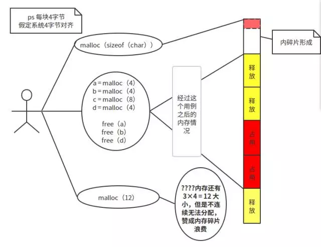

##基本知识
我们知道STL有由六大组件构成：容器、迭代器、算法、适配器、仿函数、配置器；其中，仿函数类似于函数，可以用于算法的策略选择；配置器即我们今天要讲的空间配置器。
###空间配置器简介
STL空间配置器分为两级：
* 
一级空间配置器(__malloc_alloc_template)：申请空间大于128Bytes时,直接包装malloc、realloc、free等函数
* 
二级空间配置器(__default_alloc_template)：申请空间小于等于128Bytes
* 
配置器最小的分辨度是8Byte

由于一级空间配置器包装malloc等函数，所以申请和释放的过程和正常的glibc差不多。我们主要介绍二级空间配置器

对于基本的malloc分配我们都知道，容易产生碎片：

###二级空间配置器
这个分配器采用了**内存池**的思想，有效地避免了内碎片的问题（顺便一句话介绍一下内碎片和外碎片：内碎片是已被分配出去但是用不到的内存空间，外碎片是由于大小太小而无法分配出去的空闲块）。
####过程
首先介绍四个基本的API：
* void* allocate(size_t \__n) 　　　　　　　　// 外部 API，分配内存
1. 
void deallocate(void* \__p, size_t \__n)　　　　　// 外部 API，回收内存，以供再利用；\__P、\__n必须是allocate得到的；
* 
char* chunk_alloc(size_t \__size, int& \__nobjs)　// 内部函数，用于分配一个大块
* 
void* refill(size_t n) 　　　　　　　　　　　// 内部函数，用于 allocate 从 free_list 中未找到可使用的块时调用

[返回目录](README.md)