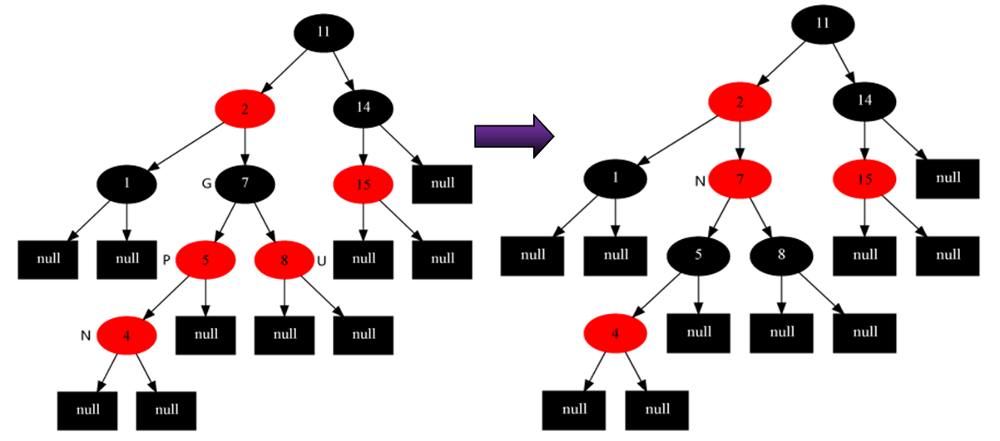
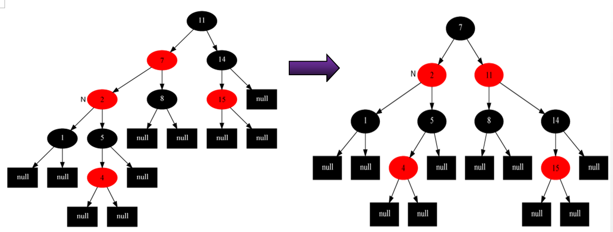
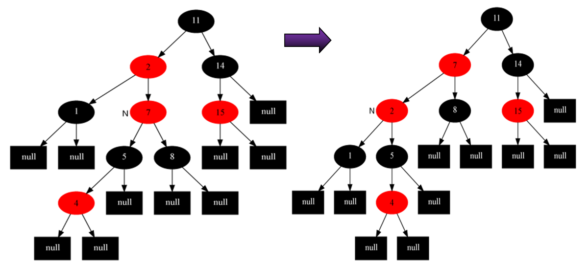

##[红黑树](http://blog.csdn.net/chenhuajie123/article/details/11951777)
* 
性质：是平衡二叉树的一种
    * 
所有节点非红即黑
    * 
所有红节点的子节点都是黑的
    * 
根节点是黑的
    * 
叶子节点(NIL指针，仅代表树在此结束)和NULL节点是黑的
    * 
对每个结点，从该结点到其子孙结点的所有路径上包含相同数目的黑结点。
#### 使一棵n个结点的红黑树始终保持了logn的高度，从根到叶子的最长的可能路径不多于最短的可能路径的两倍长：注意到性质2导致了路径不能有两个毗连的红色节点就足够了。 最短的可能路径都是黑色节点，最长的可能路径有交替的红色和黑色节点。因为根据性质4所有最长的路径都有相同数目的黑色节点，这就表明了没有路径能多于任何其他路径的两倍长。

####6.1 红黑树5种插入的几种情况：
红黑树保证最深不会比最浅两倍：插入的涂红色，然后在修改
* 
情况0：当前无节点，自己是根节点-----------》直接着黑色即可
* 情况1：父亲是黑色-------------------------------》直接插入即可

　　　　　以上两种情况都是不用修复红黑树的！ 
　　　　　但存在下面三种需要修复的情况：**要插入节点的父节点为红色**
* 
情况2：父亲是红色
    * 2.1
叔叔y是红色的：爷爷肯定是黑的！
        * 
方案：父节点和叔叔节点涂黑，祖父结点涂红，把当前结点指向祖父节点；重新开始算法（调整）。

    * 2.2
叔叔y是黑色的，且自己是右孩子
        * 
方案：父节点做为新的当前节点，以新当前节点为支点左旋。

    * 2.3
叔叔y是黑色的，且自己是左孩子
        * 
方案：父节点变为黑色，祖父节点变为红色，在祖父节点为支点右旋。

####6.2 红黑树删除的几种情况。
* 情况1：
x的兄弟w是红色的。
* 情况2：
x的兄弟w是黑色的，且w的俩个孩子都是黑色的。
* 情况3：
x的兄弟w是黑色的，且w的左孩子是红色，w的右孩子是黑色。
* 情况4：
x的兄弟w是黑色的，且w的右孩子是红色的。

所以为了使插入、或删除结点后的树依然维持为一棵新的红黑树，
那就要做**三方面**的工作：
* 0
首先要查找到结点要插入／删除的位置，然后进行插入／删除
* 1
部分结点颜色，重新着色
* 2
调整部分指针的指向，即左旋、右旋。

[返回目录](README.md)