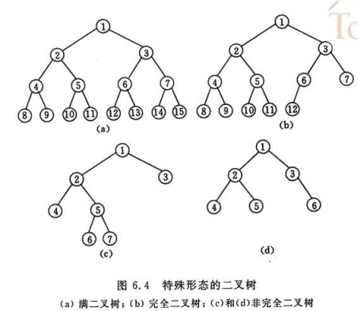

#树型结构
1. 
树是n(n>=0)个节点的有限集，如果非空：<br>
　　１）有且仅有一个根节点<br>
　　２）每个节点有且仅有一个父亲节点，可有多个子节点
1. 
基本概念：<br>
节点的子树数称为节点的度<br>
节点的层次从根节点第一层开始算，最大的层次称为树的深度<br>
从下往上称为高度<br>
1. 
二叉树：每个节点最多两个字树，而且字树有左右之分<br>
满二叉树与完全二叉树：<br>

  存储：链式为主。
```C
typedef struct BitNode{
    TElemType data;
    struct BitNode *lchild,*rchild;
}BitNode,*BiTree;```
遍历：先根遍历、中根遍历、后根遍历
```C
status PreOrder(BiTree T){
    if(T){
        print(T->data);
        if(PreOrder(T->lchild))
            if(PreOrder(T->rchild))
                return OK;
        return error;
    }else
        return OK;
}```