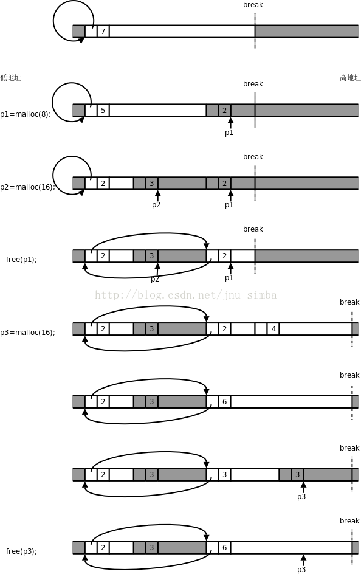

###几个函数
* 
malloc：申请一段内存，不初始化；所以第一次读取数据时会发生缺页中断，进入内核态。
* 
calloc：申请一段内存，初始化为0
* 
realloc：重新对原有的空间，分配大小。一般是扩容：realloc(pt, 1000*sizeof(char));
* 
alloca：最特殊的开辟栈空间方法，优点是当离开调用这个函数的时候，栈所分配的空间会自动释放（也就是free）

###基础点
当一个进程发生缺页中断的时候，进程会陷入内核态，执行以下操作： 
* 
检查要访问的虚拟地址是否合法 
* 
查找/分配一个物理页 
* 
填充物理页内容（读取磁盘，或者直接置0，或者啥也不干） 
* 
建立映射关系（虚拟地址到物理地址） 
* 
重新执行发生缺页中断的那条指令 

##内存分配器：
* 
dlmalloc - 通用分配器
* 
ptmallac2- glibc
* 
jemalloc - FreeBSD & Firefox
* 
tcmalloc - Google
* 
libumem - Solaris ...<br>
每种内存分配器都说他们是最快的、可扩展并且具有高效的内存使用！！但是并非所有的分配器都适合我们自己的应用程序。内存消耗大的应用性能很大程度依赖于内存分配器的性能。本文中，我只讨论 "glibc malloc” 内存分配器。并希望今后能涉及到其他内存分配器的讨论。本文中为了更好的理解 ”glibc malloc”,我会联系它最近的源码来谈。
*  
ptmalloc2 来自于 dlmalloc 的分支：因为dlmalloc不支持多线程（它用一个临界段管理所有的堆，大家共享）；但是ptmalloc增加了多线程支持（它使每个线程自己管理一个堆分段，因此空闲列表堆段也是自己的）====逐渐形成malloc


###[内存分配](http://blog.csdn.net/littlehedgehog/article/details/2856933)
内存的延迟分配：用户申请内存的时候，只是给它分配了一个线性区（也就是虚存），并没有分配实际物理内存；只有当用户使用这块内存的时候，内核才会分配具体的物理页面给用户，这时候才占用宝贵的物理内存。内核释放物理页面是通过释放线性区，找到其所对应的物理页面，将其全部释放的过程。
* 
分配和释放的调用：brk(小于128K),sbrk,mmap(大于128K),unmmap。而它们的参数就是虚拟内存
```C
char *p=malloc(2048); //这里只是分配了虚拟内存2048，并不占用实际内存。 
strcpy(p,”123”) ;//分配了物理页面，虽然只是使用了3个字节，但内存还是为它分配了2048字节的物理内存。 
free(p) ;//通过虚拟地址，找到其所对应的物理页面，释放物理页面，释放线性区。  
```
但并不是每次申请是否都系统调用，glibc负责批发和零售<br>
所以：分配的是虚拟内存，没有分配物理内存。在第一次访问已分配的虚拟地址空间的时候，发生**缺页中断**，操作系统负责分配物理内存，然后建立虚拟内存和物理内存之间的映射关系。

##glibc的[malloc](http://blog.163.com/xychenbaihu@yeah/blog/static/132229655201210975312473/)内部机制
可以先运行下面的程序，会发现：16、24、32、40(32Bit系统)；32、48、64(64Bit系统)；会有跳变<br>当然也可以用top命令重点才看res(Resident size)指标

```C
#include <stdio.h>
#include <stdlib.h>
void main()
{
    char *p1;
    char *p2;
    int i=1;
    printf("%d\n",sizeof(char *));
    for(;i<100;i++)
    {
        p1=NULL;
        p2=NULL;
        p1=(char *)malloc(i*sizeof(char));
        p2=(char *)malloc(1*sizeof(char));
        printf("i=%d     %d\n",i,(p2-p1));   //两个指针的距离===得到内存布局
    }

    getchar();
}
```
####为什么会这样？
不是申请多少用多少吗？从上面知道glibc是批发和零售的，所以不会每次都去“进货”，那么一次批发多少？
<br>通过查看glibc源码中malloc.c可知：
```C
#ifndef INTERNAL_SIZE_T  
#define INTERNAL_SIZE_T size_t  
#endif  
#define SIZE_SZ                (sizeof(INTERNAL_SIZE_T))  
#ifndef MALLOC_ALIGNMENT  
#define MALLOC_ALIGNMENT       (2 * SIZE_SZ)  
#endif  

/*===================================================================
    MALLOC_ALIGNMENT：是不是对齐单位？
    不是，这个是每次申请空间大于阀值(下面的MINSIZE)时，补充的大小；
===================================================================*/
//注：在glibc中空闲的内存块会由双链表连起来，每个链表结点就是一个管理单元，它的结构定义如下：

struct malloc_chunk {  
  INTERNAL_SIZE_T      prev_size;  /* Size of previous chunk (if free).  */  
  INTERNAL_SIZE_T      size;       /* Size in bytes, including overhead. */  
  struct malloc_chunk* fd;         /* double links -- used only if free. */  forward point
  struct malloc_chunk* bk;              // back point
};  

/*=================================================================================
    An allocated chunk looks like this:  
    chunk-> +-+-+-+-+-+-+-+-+-+-+-+-+-+-+-+-+-+-+-+-+-+-+-+-+-+-+-+-+-+-+-+-+  
            |             Size of previous chunk, if allocated            | |  
            +-+-+-+-+-+-+-+-+-+-+-+-+-+-+-+-+-+-+-+-+-+-+-+-+-+-+-+-+-+-+-+-+  
            |             Size of chunk, in bytes                       |M|P|  
      mem-> +-+-+-+-+-+-+-+-+-+-+-+-+-+-+-+-+-+-+-+-+-+-+-+-+-+-+-+-+-+-+-+-+  
            |             User data starts here...                          .  
            .                                                               .  
            .             (malloc_usable_size() bytes)                      .  
            .                                                               |  
nextchunk-> +-+-+-+-+-+-+-+-+-+-+-+-+-+-+-+-+-+-+-+-+-+-+-+-+-+-+-+-+-+-+-+-+  
            |             Size of chunk                                     |  
            +-+-+-+-+-+-+-+-+-+-+-+-+-+-+-+-+-+-+-+-+-+-+-+-+-+-+-+-+-+-+-+-+  
*    由上可知，使用malloc时消耗系统内存的最小单位就是sizeof(struct malloc_chunk)。
*   实际上，差不多就是这样，只是还需要将sizeof(struct malloc_chunk)作内存对齐。
===============================================================================================*/           
            
#define MALLOC_ALIGN_MASK      (MALLOC_ALIGNMENT - 1)  
#define MIN_CHUNK_SIZE        (sizeof(struct malloc_chunk))  
#define MINSIZE  /  
  (unsigned long)(((MIN_CHUNK_SIZE+MALLOC_ALIGN_MASK) & ~MALLOC_ALIGN_MASK))  
/* pad request bytes into a usable size -- internal version */  
#define request2size(req)                                         /  
  (((req) + SIZE_SZ + MALLOC_ALIGN_MASK < MINSIZE)  ?             /  
   MINSIZE :                                                      /  
   ((req) + SIZE_SZ + MALLOC_ALIGN_MASK) & ~MALLOC_ALIGN_MASK)
/*===================================================================
    从上可知：
        1）32Bit系统下MINSIZE大小是16B，其中去掉4B(即SIZE_SZ)的保留大小，用户可以使用的12B；
            而当申请13B时，request2size发现大于MINSIZE大小，就额外分配MALLOC_ALIGNMENT(8B)大小；
            所以才会有16、24、32、40等关键值；
            申请：0~12B时，分配16B；
                  13~20B时，分配24B；
                为什么不是13~24B？因为我们指定，扩充每次扩充MALLOC_ALIGNMENT大小，所以只额外多了8B；
        2）64Bit系统下MINSIZE大小是32B，其中去掉8B的保留大小，用户可以使用的24B；
            而当申请25B时，request2size发现大于MINSIZE大小，就额外分配MALLOC_ALIGNMENT(16B)大小；
            所以才会有32、48、64等关键值；
            申请：0~24B时，分配32B；
                  25~40B时，分配48B；
                为什么不是25~48B？因为我们指定，扩充每次扩充MALLOC_ALIGNMENT大小，所以只额外多了16B；
===================================================================*/
```
* 
C++中的new底层也是用的malloc实现的
    ```C++
    #include <vector>  
    using namespace std;  
    int main(int argc, char *argv[])  
    {  
        int malloc_size = atoi(argv[1]);  
        vector<char *> malloc_vec(1 * 1024 * 1024);  
        for (size_t i = 0; i < malloc_vec.size(); ++i) {  
            malloc_vec[i] = new char[malloc_size];  
        }  
        while (1) {}  
        return 0;  
    }  
    输入23，25会top命令查看内存使用，发现40、56M出跳变：原因vector本身占用8M，剩余32M、48M。同理！！！
```

###malloc过程


图中白色背景的框表示 malloc管理的空闲内存块，深色背景的框不归 malloc管，可能是已经分配给用户的内存块，也可能不属于当前进程， Break之上的地址不属于当前进程，需要通过 brk系统调用向内核申请。每个内存块开头都有一个头节点，里面有一个指针字段和一个长度字段，指针字段把所有空闲块的头节点串在一起，组成一个环形链表，长度字段记录着头节点和后面的内存块加起来一共有多长，以 8字节为单位（也就是以头节点的长度为单位）。


1. 一开始堆空间由一个空闲块组成，长度为 7×8=56字节，除头节点之外的长度为 48字节。

2. 调用 malloc分配 8个字节，要在这个空闲块的末尾截出 16个字节，其中新的头节点占了 8个字节，另外 8个字节返回给用户使用，注意返回的指针 p1指向头节点后面的内存块。

3. 又调用 malloc分配 16个字节，又在空闲块的末尾截出 24个字节，步骤和上一步类似。

4. 调用 free释放 p1所指向的内存块，内存块（包括头节点在内）归还给了 malloc，现在 malloc管理着两块不连续的内存，用环形链表串起来。注意这时 p1成了野指针，指向不属于用户的内存， p1所指向的内存地址在 Break之下，是属于当前进程的，所以访问 p1时不会出现段错误，但在访问 p1时这段内存可能已经被 malloc再次分配出去了，可能会读到意外改写数据。另外注意，此时如果通过 p2向右写越界，有可能覆盖右边的头节点，从而破坏 malloc管理的环形链表， malloc就无法从一个空闲块的指针字段找到下一个空闲块了，找到哪去都不一定，全乱套了。

5. 调用 malloc分配 16个字节，现在虽然有两个空闲块，各有 8个字节可分配，但是这两块不连续， malloc只好通过 brk系统调用抬高 Break，获得新的内存空间。在 [K&R]的实现中，每次调用 sbrk函数时申请 1024×8=8192个字节，在 Linux系统上 sbrk函数也是通过 brk实现的，这里为了画图方便，我们假设每次调用 sbrk申请 32个字节，建立一个新的空闲块。

6. 新申请的空闲块和前一个空闲块连续，因此可以合并成一个。在能合并时要尽量合并，以免空闲块越割越小，无法满足大的分配请求。

7. 在合并后的这个空闲块末尾截出 24个字节，新的头节点占 8个字节，另外 16个字节返回给用户。

8. 调用 free(p3)释放这个内存块，由于它和前一个空闲块连续，又重新合并成一个空闲块。注意， Break只能抬高而不能降低，从内核申请到的内存以后都归 malloc管了，即使调用 free也不会还给内核。 
###Linux通过slab容器分配task_struct结构，这样能达到对象复用和缓存着色的目的”
* 
task_struct：学过操作系统的知道，每个进程都有一个PCB（process control block），是控制进程的唯一也是最有效的手段；在调用fork()函数创建新的进程时时系统自动为我们创建的。
* 
slab分配器：某些对象（如进程描述符等）由于频繁的申请和释放内存，而它们很小，那么很可能就出现很多的内部碎片而且分配效率和速度都不好；而slab分配器正是基于对象进行管理的，对于相同的对象归为一类，当申请时从一个slab列表中分配，回收时再加入进来，减少碎片，也减少频繁的申请和释放内存调用；
 slab分配器使用slab分配算法进行实现并采用空间换时间的方式提高分配效率
* 
对象复用 ：对象就是对象，而复用指的是
slab分配器对于已分配的对象并不丢弃，而是释放并把它们保存在内存中。这样当以后又要请求新的对象时，就可以从内存直接获取而不用重复初始化。=======》像不像Java中申请内存
* 
slab缓解内部碎片问题，buddy算法负责外部碎片问题


[返回目录](README.md)