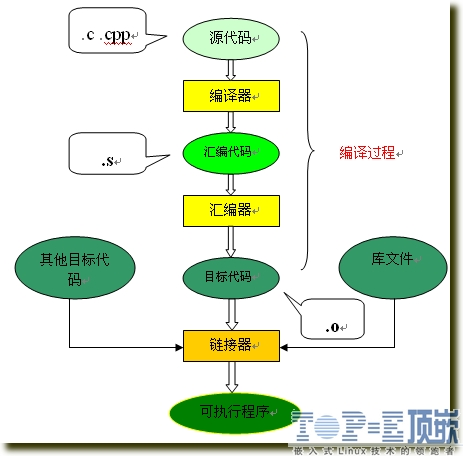
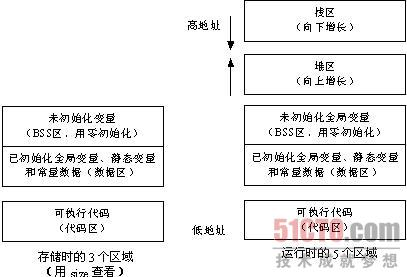

1. 以32-bit为标准

| 类型 | 字节 | 最小 | 最大 | 注 |
| -- | -- | -- | -- | -- |
| bool | 1 | false | true | 只有两个值 |
| BOOL | 4 | false | true | 就是int型 |
| char | 1 | -128 | 127 | -128~127 |
| Uchar | 1 | 0 | 255 | 0~255 |
| short | 2 | -32768 | 32767 | -32768~32767 |
| Ushort | 2 | 0 | 65535 | 0~65535 |
| int | 4 | -2,147,483,648 | 2,147,483,647 | -2,147,483,648~2,147,483,647 |
| Uint | 4 | 0 | 4,294,967,295 | 4十亿：10位 |
| long | 4 | 同上 | 同上 | 10位 |
| Ulong | 4 | 同上 | 同上 | 10位 |
| long long | 8 | 9,223,372,036,854,775,808 | 9,223,372,036,854,775,807 | 19位 |
| float | 4 | 3.4E+10的负38次方 | 3.4E+10的38次方 | 38位 |
| double | 8 | 1.7E+10的负308次方 | 1.7E+10的正308次方 | 308位 |
| long double | 16 |  |  |  |
《C和指针》中写过：long与int：标准只规定long不小于int的长度，int不小于short的长度.

* 
C/C++数组初始化时，如果有指定的值是指定的值，其他自动补0.但是如果没有指定的值，初始化情况
1. 
一个.c文件到.exe的过程
  * 预编译，展开头文件以及一些宏
  * 编译：语法检查等，得到汇编代码
      * 词法分析、语法分析、语义分析、源代码优化、代码生成、目标代码优化。
  * 汇编：将汇编代码编译成目标代码，生成符号表、虚函数表等，
  * 链接形成可执行文件
  * 如下：
  *   
1. 
堆和栈比较

| 堆 | 栈 |
| -- | -- |
| 低向高增长 | 高向低增长 |
| 用户自己管理 | 编译器管理 |
| 慢 | 快 |
| 出入顺序不定 | 先入后出 |
| 有碎片 | 无碎片 |
| 不连续的内存空间 | 空间连续 |
1.
 普通程序[内存空间](http://blog.csdn.net/youoran/article/details/10990815)



| 区域 | 保存 | 运行 |
| -- | -- | -- |
| 代码区 | 机器指令 | 机器指令(立即数直接在，常量、变量和函数带着地址) |
| 数据区 | 全局变量、静态变量（包括全局静态变量和局部静态变量）和常量数据（如字符串常量） | 同左 |
| BSS区 | 全局未初始化变量 | 同左，会变化 |
| 堆 | 无 | 动态内存分配 |
| 栈 | 无 | 编译器自动分配释放，存放函数的参数值、局部变量的值等 |


1. 
c和C++比较
  * 最简单也就是C面向过程，强掉过程（算法和结构）---由输入经过计算得输出，C++面向对象，强掉设计 =====》所以开始时才有C++叫C-with-class
  * C++支持而C不支持：面向对象、继承、泛型技术、重载（普通和操作符）、STL等
  * C支持而C++不支持：很少
  * C和C++都支持但是语法不同：const、struct、void*、auto、IO
1. 
[进程通信IPC](./../reference/process_thread_diff.md)
1. 
override、overload
1. 
[单例模式](../C++/singleton.md)
1. 
生产者-消费者  加锁
    * 
P操作：申请，减少一个
    * 
V操作：生产，增加一个，唤醒
1. 
BOOL , float, 指针变量 与“零值”比较的 if 语句
```C
    解答：
    BOOL型变量：if（！var）
    int型变量： if（var==0）
    float型变量：
      const float EPSINON = 0.00001；
      if （（x >= - EPSINON） && （x <= EPSINON）
    指针变量：　if（var==NULL）```
* 
三种传参的不同、返回值的不同
    * 
值传递
    * 
引用传递
    * 
指针传递
* 
[strlen](./../C++/C_relatives/fun.md)（）的实现
* 
C语言参数的入栈顺序，为什么这样？
    * 
自右向左
    * 
是为了支持**可变长参数**形式：如果先左即栈底是不知道参数个数的。
* C的参数：
  ```C
  int a = 10,b = 20 , c = 30;
  printf("\n %d .. %d .. %d \n", a+b+c,(b = 2*b),(c = 2*30));
    =====> 110 .. 40 .. 60
  因为C中参数是从右向左来的！！！ 
  ```
* 
C语言的字符串反转效率
* C语言main()中return和exit(x)的区别<br>
  * exit是系统调用，意味着进程的结束，不会触发退栈操作，将控制权交给系统或者父进程
  * return是C语言的函数调用它将触发退栈操作，将控制权交给调用函数。
* C++为什么支持重载，而C不支持<br>
  因为编译的时候，C只会关心名字而C++会将参数也加入编译，从而得到函数名，即便函数名相同，只要参数不同，它们的符号名是不会冲突的，所以可以重载
```C  
符号名就会按如下规则来处理
1、 符号以_Z开始
2、 如果有嵌套，后面紧跟N，然后是名称空间、类、函数的名字，名字前的数字是长度，以E结尾
3、 如果没嵌套，则直接是名字长度后面跟着名字
4、 最后是参数列表，类型和符号对应关系如下```


[返回目录](README.md)