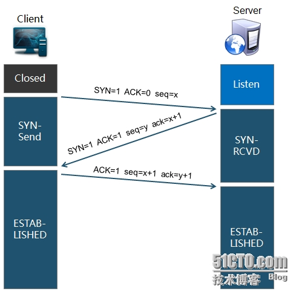

[数据包在网络中的过程](http://blog.csdn.net/waitforfree/article/details/50771777)

**网络字节序，大小端**

大小端：主要是多字节值的哪一端存放在起始地址处（即低地址处）。
* 大端 ：高字节在低地址处，直观。
* 小端 ：低字节在低地址处
* 如示例：
 

TCP/UDP/IP网络协议规定：接收的第一个字节是高字节，会放到低地址处。<br>所以要求发送方第一个字节应该**发送高字节。由从低地址处取**，所以一般是大端。
网络传输的都是**字节流**

#### OSI七层：TCP、IP/模型
| OSI | ： | TCP/IP |
| -- | -- | -- |
| 应用层： |  
| 表示层：通讯系统通信 |  | 应用层 |
| 会话层：进程间通信 |  
| 传输层：报文段TCP、用户数据报UDP；主机进程点对点通信 |  | 传输层 |
| 网络层：数据报传递 |  | 网络层 |
| 数据链路层：数据帧传递 | | 数据链路层 |
| 物理层：比特位传输 |  | 物理层 |

**基础知识：什么是TCP/IP、UDP、Socket**

  TCP/IP(Transmission Control Protocol/Internet Protocol)<br>
  UDP(User Data Protocol)<br>
  网络模型图：
  

那么Socket在那呢？

  
     <br>  Socket是应用层与TCP/IP协议族通信的中间软件抽象层，它是一组接口。在设计模式中，Socket其实就是一个门面模式，它把复杂的TCP/IP协议族隐藏在Socket接口后面，对用户来说，一组简单的接口就是全部，让Socket去组织数据，以符合指定的协议。<br>
      
 
**HTTP的过程和原理，以连接www.baidu.com为例**
  * 
  首先需要建立socket连接(IP和port)，所以会先做DNS解析，由url网址得到IP地址：
      * 
本地向本地域名服务器查询，如果没有，本地域名服务器向上层域名服务器请求，直至根服务器。 注：本机在配置网络的时候会指定本地DNS服务器，而且一般浏览器也有自己的缓存
      * 
得到IP地址，port是指定好的。
  * 
建立Sockect连接
  * 
然后发送web请求给指定的web服务器：GET、POST
  * 
服务器收到请求后发送给客户端资源文件等
  * 
客户端解析得到的资源文件，如果还有需要(如网页图片等)，会继续发送请求。
  * 
渲染给用户
  * 
关闭连接

**TCP 连接的过程和特点，TCP为什么需要三次握手？两次可以吗？**



  * 
第一次：客户端告诉服务器我要和你通信，同时同步序列号为你可以用该序列段起始地址回应我。（这些字段的作用是这样的：通过SYN=1，ACK=0告诉server这是连接请求Connection Requet。SEQ=x表明后面传送数据时的第一个数据字节的序号是x+1）
  * 
第二次：服务器说，好的，你可以发送数据了；用这个序列号作为起始数据段来回应我；(server通过SYN=1，ACK=1告诉client，这是接受请求Connection Accepted。确认你是要从x+1传起了。server也通知client，我要传给你的是从y+1传起的哦！）====此后服务器资源已经分配了，而客户需要第三次才分配，所有DDOS攻击
  * 
第三次：客户端说，哦好的，我知道你准备好了，那么接下来我发送数据了哈！（但是第三次理论上可以带数据，没有SYN标志即可，client告诉server，OK，我是要建立连接，你可以建立了！第三次不带数据就不会消耗序列号，带了就消耗）

  所以必须三次握手啊，如果第三次没有而只有两次，那么如果第二次服务器发的丢失了或者其他原因客户没收到，那么服务器以为客户收到了一直等待，而客户就一直等待服务器反馈知道遇到指定的同步序列号才行，所以服务器发送其他的即使客户收到了，但同步号不对也会忽略，那么客户就等着吧永远不会连接上。<br>
特点：
* 
没有应用层的数据
* 
SYN这个标志位只有在TCP建产连接时才会被置1
* 
握手完成后SYN标志位被置0

**TCP四次挥手**


  * 
客户端得到所需，然后说我好了，需要断开了，FIN=1。你可以用同步序列号为起始回应我
  * 
服务器说，好的，那我准备关闭，把没发完的数据给你。
  * 
服务器说：我已经关了，你没机会了。FIN=1
  * 
客户端：好吧，你真快，那我也关了。双方结束！<br>

为什么四次？<br>TCP连接是全双工的，所以双方都要关闭。如果最后一个不发即服务器收不到，那么服务器不能进入正常关闭状态，而客户段已经关闭，不可能发了。

**UDP与TCP的区别，应用场景。**<br>
  * 
TCP连接是全双工的，是面向连接的；而UDP不需要连接，不可靠信道。
  * 
TCP可靠稳定的传输，UDP只保证最大努力交付，不可靠不稳定。也就是说，通过TCP连接传送的数据，无差错，不丢失，不重复，且按序到达;UDP尽最大努力交付，即不保证可靠交付
  * 
TCP可以传大量数据，UDP少量
  * 
TCP慢效率不高易受攻击，UDP快比TCP安全一点(不需要建立连接)
  * 
TCP面向字节流，实际上是TCP把数据看成一连串无结构的字节流;UDP是面向报文的
UDP没有拥塞控制，因此网络出现拥塞不会使源主机的发送速率降低（对实时应用很有用，如IP电话，实时视频会议等）
  * 
每一条TCP连接只能是点到点的；UDP支持一对一，一对多，多对一和多对多的交互通信
  * 
TCP首部开销20字节;UDP的首部开销小，只有8个字节

<br>
**那么到底是用UDP还是TCP呢？**
  * 
  UDP适用于一次只传送少量数据、对可靠性要求不高的应用环境。如QQ语音、视频等
  * 
TCP适用于对网络环境或通讯质量要求高的环境：数据需要准确无误的发送给对方时，如HTTP、HTTPS、SMTP、FTP，QQ文件传输等
  * 
如果是由客户端间歇性的发起无状态的查询，并且偶尔发生延迟是可以容忍，那么使用HTTP/HTTPS吧。
  * 
如果客户端和服务器都可以独立发包，但是偶尔发生延迟可以容忍（比如：在线的纸牌游戏，许多MMO类的游戏），那么使用TCP长连接吧。
  * 
如果客户端和服务器都可以独立发包，而且无法忍受延迟（比如：大多数的多人动作类游戏，一些MMO类游戏），那么使用UDP吧。

**UDP与TCP优缺点**<br>
  * 
TCP慢效率不高易受攻击，UDP快比TCP安全一点(不需要建立连接)
  * 
TCP可靠稳定，UDP相反

**TCP如何保证可靠顺序传输**
* 
可靠是**三次连接**，顺序靠的是：**序号、确认、重传机制**
* 
每个TCP数据包都带有自己的序号即本次发送数据中第一个字节的序号；而接受方也根据本次接收的序号和大小从而计算出下次应该放松的序号；
* 
对于发送方来说，每次发送一个包，就会设置对应的到计时器：如果时间到了还没有收到确认那么就会重传
* 
接收方每次收到对应的序号包，就会把该包的确认发送给发送方；
* 
TCP规定收方每当收到大于期望序号的包就发送一个**冗余ACK**，其中指明自己期望的序号；而发送方如果收到对同一个报文的3个冗余ACK那么就认为该报文丢失，发送方此时立即重发。

**拥塞控制**<br>
滑动窗口：<br>
* 
比如滑动窗口大小为4KB，也就是说发送方只能发送4KB(这4KB未经确认，如果确认一个则发送方可以再发一个)。
* 
接收方接收到一个，就发一个确认，那么发送窗口就向前滑动一个即可以再发一个

拥塞相关：
* 
接收端根据接收缓存的大小，动态调整发送端窗口大小：接收窗口rwnd。在接收方的TCP包头部，发送方收到后，就按此次大小（单位字节）发送数据；
* 
发送方对当前网络的拥塞程度估计得到窗口：拥塞窗口cwnd。
    * 
慢开始和拥塞避免
    * 
快重传和快恢复

拥塞控制：防止发送过多数据给网络，造成路由等过载，增加负荷；===全局的<br>
流量控制：防止发送过多导致接收不了。====端对端的<br>
所以说发送多少是按照接收窗口和拥塞窗口一起控制的，**最小值**！

**DNS域名解析过程及协议**
* 
第一步： 客户端发出域名解析请求， 将该请求发送给本地域名服务器(一般浏览器也有自己的缓存，这个是第一次查找的对象)；本地域名服务器是配置网络连接的时候配置的
* 
第二步：本地域名服务器收到请求后， 先查询本地缓存，若有缓存， 直接将结果返回给客户端。
* 
第三步：若本地无缓存，则本地域名服务器**直接将请求发送给根域名服务器**。然后根域名服务器返回给本地一个子域名服务器。
* 
第四步：本地域名服务器重定向返回的子域名服务器。向子域名服务器发送请求， 子域名服务器接收请求后，查询自己的缓存， 如果没有，则返回相关的下级域名服务器的地址。
* 
第五步：重复第四步，直到找到正确的记录。
* 
第六步：本地域名服务器把返回的结果保存到缓存中，以备下次使用。同时将结果返回给客户端。

**ARP过程**<br>
IP地址获得物理地址<br>
* 
当主机A向本局域网上的某个主机B发送IP数据报时，就先在自己的ARP缓冲表中查看有无主机B的IP地址。
* 
如果有，就可以查出其对应的硬件地址，再将此硬件地址写入MAC帧，然后通过以太网将数据包发送到目的主机中。
* 
如果查不到主机B的IP地址的表项。可能是**主机B才入网，也可能是主机A刚刚加电**。其高速缓冲表还是空的。在这中情况下，主机A就自动运行ARP。
  * 
ARP进程在本**局域网上广播**一个ARP请求分组。ARP请求分组的主要内容是表明：我的IP地址是192.168.0.2，我的硬件地址是00-00-C0-15-AD-18.我想知道IP地址为192.168.0.4的主机的硬件地址。
  * 
在本局域网上的所有主机上运行的ARP进行都收到此ARP请求分组。
  * 
主机B在ARP请求分组中见到自己的IP地址，就向主机A发送ARP响应分组，并写入自己的硬件地址。其余的所有主机都不理睬这个ARP请求分组。ARP响应分组的主要内容是表明：“我的IP地址是192.168.0.4,我的硬件地址是08-00-2B-00-EE-AA”,请注意：虽然ARP请求分组是广播发送的，但ARP响应分组是普通的**单播**，即从一个源地址发送到一个目的地址。
  * 
主机A收到主机B的ARP响应分组后，就在其ARP高速缓冲表中写入主机B的IP地址到硬件地址的映射。

**ABC 类地址**


* 
网络号+主机号 或者 网络前缀+主机号
    * 
比如：185.46.54.45/24。表示24位的网络前缀(网络号+子网号)，8位主机号====子网掩码就是255.255.255.0
    * 
**子网号是从主机号借来**的；子网掩码就是网络号+子网号均是1，主机号为0，两个IP的掩码就是相同的
* 
主机号全0是本机地址，全1是广播地址，主机号全0是网络本身
* 
**子网号可以全0或者全1，但是主机号不可以**
* 
网络前缀相同的连续IP可以路由聚合或称超网，相同的个数可以作为/n中的n

A类IP地址<br>
一个A类IP地址由1字节的网络地址和3字节主机地址组成，网络地址的最高位必须是"0"， 地址范围```从1.0.0.0 到126.0.0.0```。可用的A类网络有126个，每个网络能容纳1亿多个主机

B类IP地址<br>
一个B类IP地址由2个字节的网络地址和2个字节的主机地址组成，网络地址的最高位必须是"10"，地址范围```从128.0.0.0到191.255.255.255```。可用的B类网络有16,382个，每个网络能容纳6万多个主机 。

C类IP地址<br>
一个C类地址是由3字节的网络地址和1字节的主机地址组成，网络地址的最高位必须是"110"。范围```从192.0.0.0 - 223.255.255.255``` C类网络达209万余个，每个网络能容纳254个主机。
分享本回答由电脑网络分类达


**常用的端口号:0~65535共65536个，0~1023号一般都是系统的**

| 层数 | 协议与端口号 | 备注 |
| -- | -- | -- |
| 1 物理层 |  | 负责比特信号的传播 |
| 2 数据链路层 |  | 帧 |
| 3 网络层 | IP、ARP、ICMP、RIP | 数据报 |
| 4 传输层 | TCP、UDP | 数据报，屏蔽底层细节 |
| 5 会话层 | |  |
| 6 表示层 | |  |
| 7 应用层 | DNS-53、FTP-20/21、TELNET-23、SMTP-25、POP3-110、DHCP、HTTP-80、HTTPS-443 |  |


**[session](http://www.cnblogs.com/kissdodog/archive/2013/02/08/2909292.html)放在哪里？如何保存会话状态**

**nignx的异步模型与事件管理**

**HTTP返回类型**
* 
100-199 用于指定客户端应相应的某些动作。 
* 
200-299 用于表示请求成功。 
* 
300-399 用于已经移动的文件并且常被包含在定位头信息中指定新的地址信息。 
* 
400-499 用于指出客户端的错误。 
* 
500-599 用于支持服务器错误。 

[返回目录](README.md)