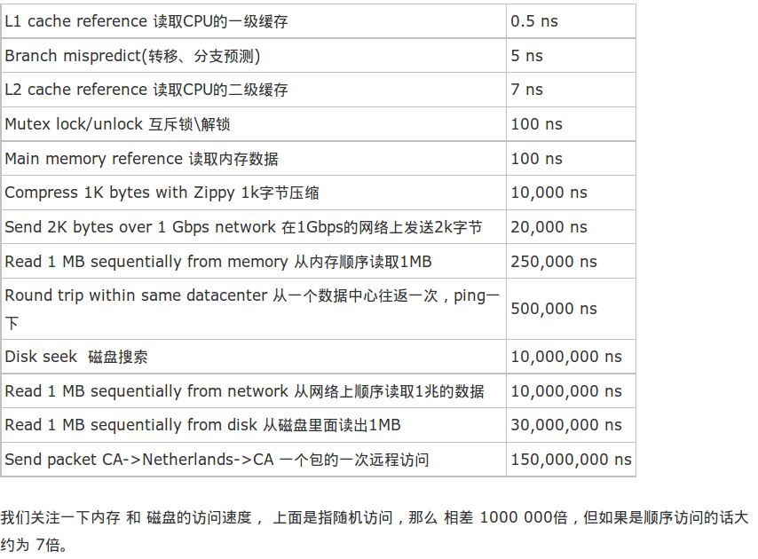

**山寨兵法：w**
* 
明修栈道，暗渡陈仓
* 
要么不做，要么做绝
* 
包罗万象

**wwin回收站恢复**
```C
打开注册表(运行regedit)---》LOCAL_MACHINE-->SOFTWARE--->MICROSOFT--
-->WINDOWS--->CURRENTVERSION--->EXPLOERER--->DESKTOP--->NAMESPACE
然后右键新建项，填入：{645FFO40-5081-101B-9F08-00AA002F954E}.
然后点击该新项，右击“默认”，数据改为“回收站”，然后重启电脑即可
```

**常用时延：**

**因特尔奔腾M：**

| to where | cycles |
| -- | -- |
| register | 1 |
| L1 | ~3 |
| L2 | ~14 |
| Memory | ~240 |
**速率：**
```C
USB2.0:理论上可达到480Mbps,但实际6Mbps
USB3.0:理论上5Gbps,但实际20~200Mbps
    请注意5Gb/s的带宽并不是5Gb/s除以8得到的640MB/s而是采用与SATA相同的10 Bit传输模式
    （在USB2.0的基础上新增了一对纠错码），因此其全速只有500MB/s。
100M以太网的速率就是100Mbps；
PCI总线到声卡的数据传输速率：MP3在256kbps码率下也平均只有1分钟2MB，所以不会超过0.3Mbps（与码率有关）。```
**编码：**

cp936是微软自己发布的用在文件系统中的编码方式。而gb2312是中国国家标准。
cp936即 code page 936（代码页936）是以GBK（国标扩展字符集）为基础的编码。GB2312（国标字符集）只是GBK的一部分。
GB2312只支持常用的汉字，而且是简体字。GBK支持繁体字和生僻字。


[返回目录](README.md)